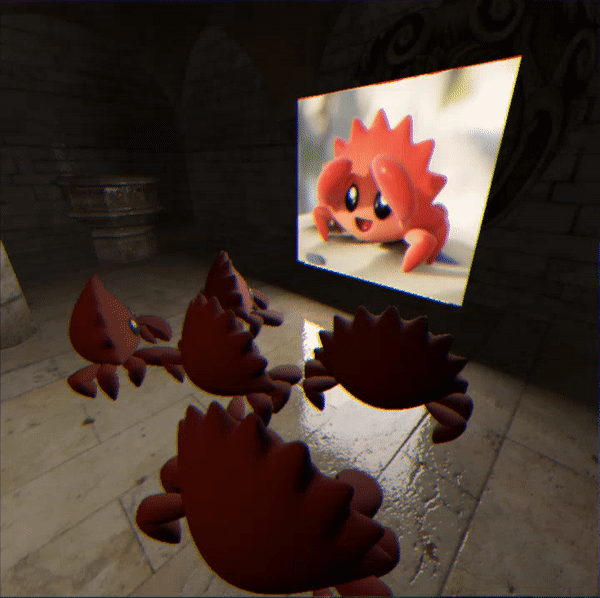

# Voidin

## Overview

The goal of this project is to research and implement modern techniques for rendering large scenes.  The code is intended to serve as a reference for others wanting to build their own renderers and template for my own explorations.

## Features

- GPU driven rendering
- Compute based frustum culling
- Instancing for reduced memory usage
- Deferred renderer architecture
- LTC based arealights
- TAA

## TODO
[ ] Implement BVH for shadow rays

## Building

Run `cargo build --release` from the main repository directory. Don't forget the --release since debug builds in Rust will run slowly.

## References

* [Real-Time Polygonal-Light Shading with Linearly Transformed Cosines](https://eheitzresearch.wordpress.com/415-2/) (2016)
* [World position reconstruction from depth](https://github.com/ARM-software/vulkan_best_practice_for_mobile_developers/blob/master/samples/performance/render_subpasses/render_subpasses_tutorial.md)
* [Two-Pass Occlusion Culling](https://interplayoflight.wordpress.com/2017/11/15/experiments-in-gpu-based-occlusion-culling/)
* [Temporal AA and the quest for the Holy Trail](https://www.elopezr.com/temporal-aa-and-the-quest-for-the-holy-trail/)
* [Kajiya Renderer](https://github.com/EmbarkStudios/kajiya/blob/d3b6ac22c5306cc9d3ea5e2d62fd872bea58d8d6/docs/gi-overview.md)
* [How to build a BVH](https://jacco.ompf2.com/2022/04/13/how-to-build-a-bvh-part-1-basics/)
